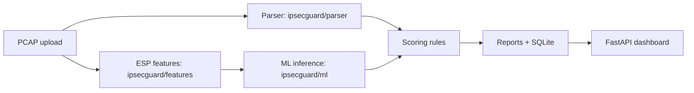

# IPsecGuard AI

IPsecGuard AI is a hackathon proof-of-concept that ingests IPsec VPN packet captures and produces a score, subscores, a threat matrix, and two reports without decrypting payloads.

## Observed vs Inferred thesis

- **Observed**: read directly from plaintext IKE fields (`IKE_SA_INIT` for IKEv2, phase 1 SA / aggressive-mode metadata for IKEv1).
- **Inferred**: derived from encrypted ESP traffic metadata with heuristics or ML, always carrying a confidence value.
- The prototype **never decrypts payloads**.

## Architecture



## Quickstart

```bash
make setup
make synth-data
make train
make demo
# open http://localhost:8000 and upload a sample from samples/
```

## What the demo includes

- Synthetic PCAP generation with IKEv2 plaintext proposals plus ESP metadata streams.
- Strict parser/ML separation so ESP cipher, tunnel-vs-transport mode, and auth method are never tagged as Observed.
- Risk scoring grounded in NIST SP 800-77 Rev. 1 style deductions.
- Executive + Technical reports rendered as HTML, with PDF output when WeasyPrint is available.
- Single-page dashboard served by FastAPI.

## Hackathon-scoped testbed

- `testbed/docker-compose.yml` scaffolds two strongSwan containers on a bridge network.
- `testbed/sweep.py` documents the intended config sweep and writes a manifest for the privileged testbed runs.
- The **primary demo path** is `scripts/synth_data.py`, so the prototype runs even without Docker, tshark, or privileged CI.

## Future work / out of scope

- Live network capture
- MITM downgrade demo
- Forward-Secrecy Proof Engine
- SMS/email alerting
- SIEM integration
- Real strongSwan Docker sweep execution in CI
- IPv6 coverage beyond the documented testbed scaffold
